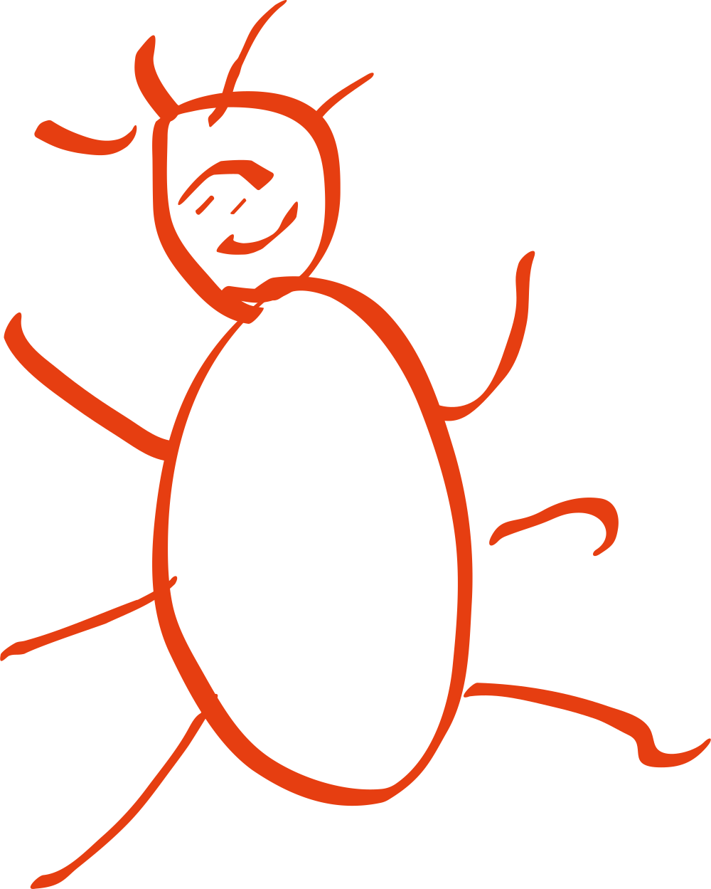

    

    <h1>
        Engineer & Junior C++/Unreal Engine developer
    </h1>
    
    
    
    
     
    

---

### :hammer_and_wrench: Languages and Tools :

    &nbsp;
    &nbsp;
    &nbsp;
    &nbsp;
    &nbsp;
    &nbsp;
    

